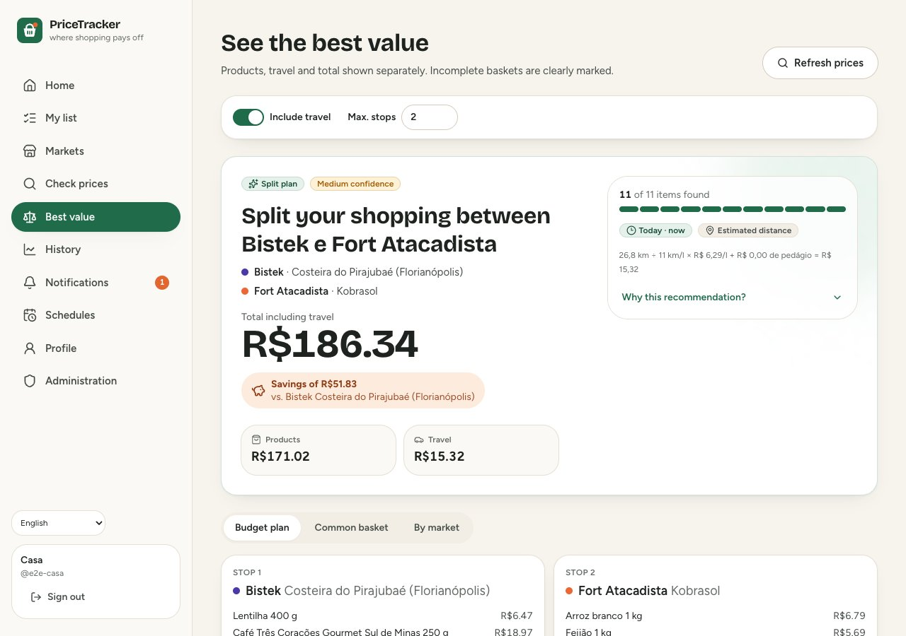
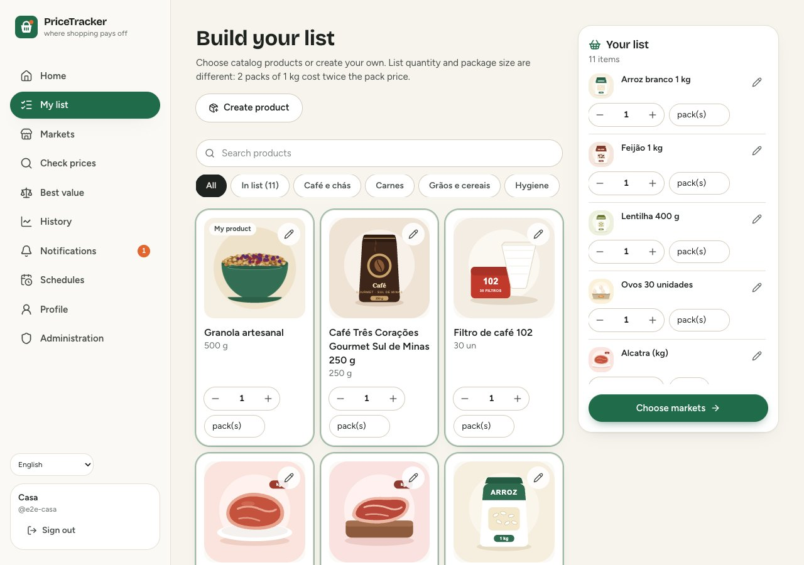
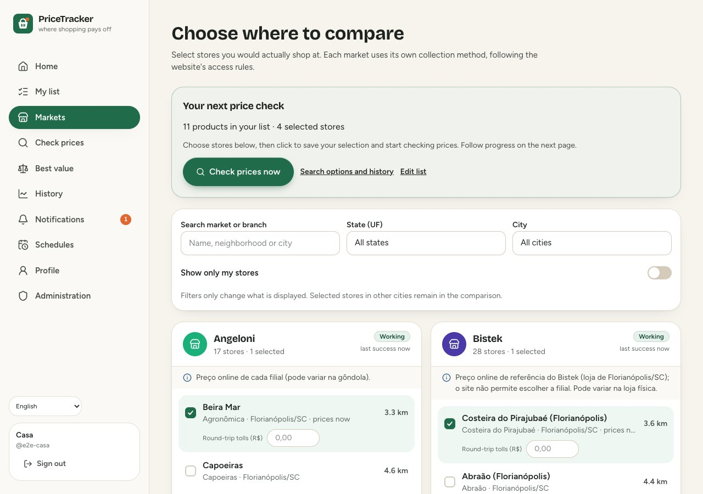
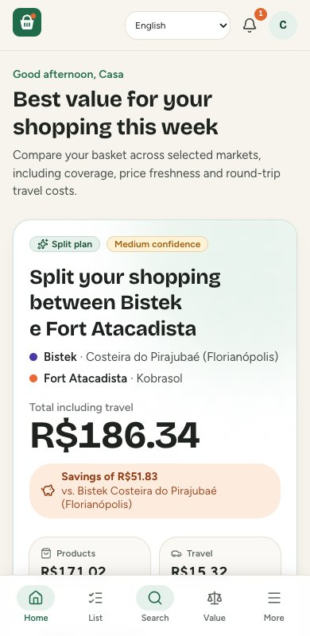
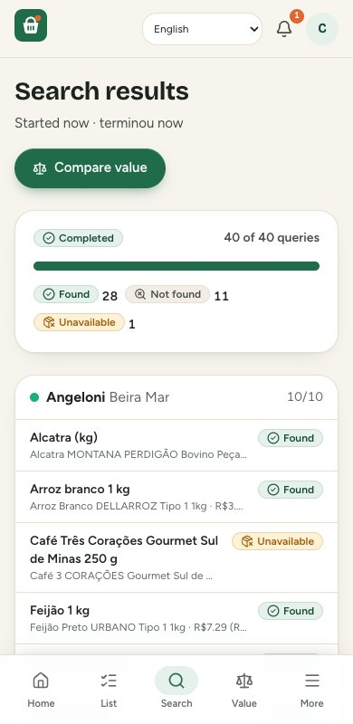
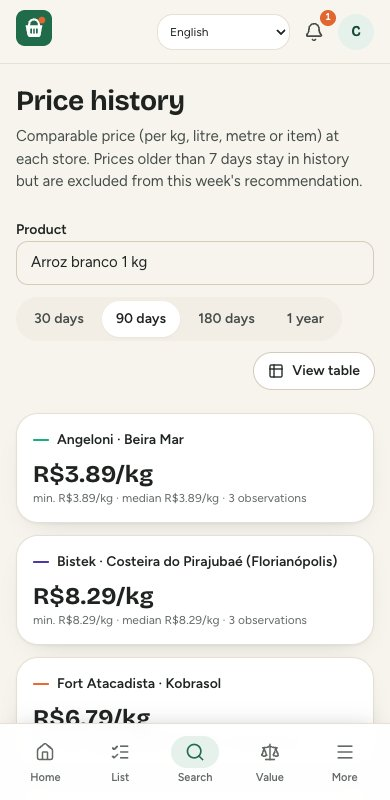
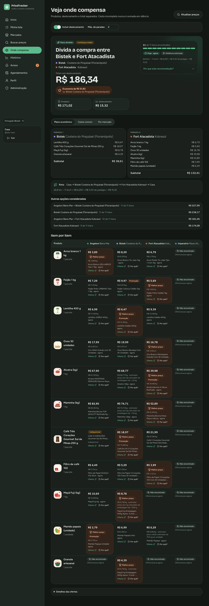

<div align="center">
  <picture>
    <source media="(prefers-color-scheme: dark)" srcset="docs/assets/wordmark-dark.svg">
    
  </picture>
  <h3>Make your grocery budget go further.</h3>
  <p>Your shopping list. Your local stores. Prices you can check.</p>
  <p>
    <a href="LICENSE"></a>
    
    
  </p>
  <p>
    <a href="#quick-start-with-docker-local">Get started</a> ·
    <a href="docs/user-guide.en.md">User guide</a> ·
    <a href="docs/markets.en.md">Add a market</a> ·
    <a href="CONTRIBUTING.md">Contribute</a> ·
    <a href="README.pt-BR.md">Português</a>
  </p>
</div>

PriceTracker compares the groceries you need across the stores you choose. See which shop has
better coverage, how recent its prices are, and whether the saving is worth the trip. Run it on
your own computer, with independent local accounts and an optional AI extraction fallback.

<p align="center">
  
  <br><sub>Compare the basket, check missing items and see the cost of the trip. Screenshots use demo data and the English interface.</sub>
</p>

## From a list to a decision

| 1. Build your list | 2. Choose your stores | 3. Check the result |
| --- | --- | --- |
| Add illustrated catalog items or your own products. Set how much you need. | Select local stores on Home. Review the list and confirm the markets before starting. | Compare products, missing items and travel costs. Open any price's source and timestamp. |

## What you can do

- Build a list from the illustrated catalog or create your own products. Every catalog product can
  be customized privately. List quantity is separate from package size.
- Choose stores on **Home**, then **Update prices → review list → confirm markets → check prices**.
  New administrator-added markets appear in this selection automatically.
- Compare double-ply toilet paper **per metre**, using the default catalog item or product template. Different roll counts
  and lengths are accepted; the basket buys whole packs to cover the metres requested.
- Compare the common basket, coverage by store and a budget plan across up to three stops.
  Missing products are always visible; incomplete baskets are never silently compared as complete.
- Track prices with a chart or a table **sortable by every column**. Set price alerts, see in-app
  notifications and schedule future checks.
- Manage markets and branches, accounts, price sources and optional AI providers in Administration.

## A look inside

| Build your list | Choose the stores |
| --- | --- |
|  |  |

| Home on your phone | Search progress | Price history |
| --- | --- | --- |
|  |  |  |

<details>
<summary>See dark mode</summary>



</details>

Screenshots are generated from the current UI with deterministic demo sources and test accounts,
without personal shopping data. README previews use English; the full gallery uses Portuguese.
They illustrate the interface, not current supermarket prices.
[Full screenshot gallery](docs/screenshots/README.md).

## Regional coverage and new markets

Built-in integrations cover **Angeloni, Bistek, Fort Atacadista and Imperatriz**. Administrators can
add branches in other Brazilian cities and states, with the price context each integration supports.
Bistek uses a shared Florianópolis/SC online reference; Imperatriz publishes Super Clube promotions
only. Adding a physical branch does not prove its shelf prices or delivery coverage.

For an unrelated chain such as Pradão, use **Administration → Markets → Add new market**. Supply the
website, a product page with a public price and, if needed, its product sitemap. The wizard validates
an actual JSON-LD Product/Offer in BRL and product discovery before registering the chain and its
first store. **Onboarding does not use an LLM or generate scraper code**: compatible sites share the
existing `public_jsonld` adapter. Websites with login, postal-code pricing or custom formats may
need a dedicated adapter. See the [source pipeline and limitations](docs/markets.en.md).

English changes interface text, number formatting and dates. It does **not** change currency (BRL),
Brazilian address fields or market coverage. Store names, listing titles and your search terms keep
their source language. Use search terms that match your stores' language.

## Quick start with Docker (local)

**This is the v1 rebuild on `feat/rebuild-v1`.** Clone that branch with the command below.
The older prototype is preserved in `legacy/`; its installation instructions are separate.

Requirements: Git, running Docker with Compose v2, Python 3 to generate secrets and a POSIX shell.
On Windows, use WSL2 with Docker integration. Docker users do not need Python 3.13, Node or an AI key.

```bash
git clone --branch feat/rebuild-v1 https://github.com/moise-s/PriceTracker.git
cd PriceTracker
./scripts/init-secrets.sh
docker compose up -d --build
docker compose ps
# Wait for persistent services to become healthy, then:
docker compose exec api pricetracker setup-code
```

Open **http://localhost:8090**, select your language and use the one-time setup code to create the
administrator. Save your recovery codes. Configure markets, build your list and check prices.
Create other accounts in **Administration → Users**. Each account has private lists and history.

Stop with `docker compose down`; restart with `docker compose up -d`. Do not use `down -v` to stop:
it deletes the data volumes. Existing v1 installations must run the included migrations; the Compose
migration service does this at startup, including support for quantities in metres.

<details>
<summary>Optional AI extraction</summary>

AI is optional. To enable Groq fallback, populate `secrets/groq_api_key` (or import it with
`./scripts/init-secrets.sh --import-groq .env`) and restart with `docker compose up -d`. Configure
providers in Administration. Normal source extraction and new-market onboarding work without AI.

</details>

Backup: `make backup`. Test restoration: `make restore-drill BACKUP=backups/pricetracker-<date>`.
See [local operations](docs/operations.md) for details. The default setup is local to the host
computer; accessing it from another device requires separate configuration.

## Questions before you start

**Can I use this outside Santa Catarina?** Yes, when your stores have a supported source. Add a
branch of an integrated chain or test an unrelated chain with the administrator wizard. The wizard
checks actual public product data; registering a store name alone cannot create price coverage.

**Do I need an AI subscription?** No. Deterministic extraction and compatible-market onboarding
work without an AI key. Optional API providers are configured separately by the administrator.

**Can I use the app in English?** Yes. Choose English on sign-in or in the language selector.
Currency remains BRL and address fields remain Brazilian; listing titles keep their source language.

**Can several people use it?** Yes, with separate local accounts and private lists/history. Start
with the host computer; access from phones or other computers needs separate network/HTTPS setup.

**What happens if a price is missing?** The result shows the gap. Older or questionable prices
are marked, and an incomplete basket is not presented as a complete comparison.

## Development

Requirements: Python 3.13+, uv, Node 22.12+ (or a supported later version), npm and Docker.

```bash
make bootstrap       # Install dependencies
make dev-db          # Disposable PostgreSQL at 127.0.0.1:55433
make dev-init        # Apply migrations and seed the development catalog
make dev-setup-code  # Generate a setup code for localhost:5173
make api             # API on :8000; run make worker in another terminal
make web             # UI at localhost:5173
make check           # Lint, types, tests and secret scan
make e2e             # Playwright with deterministic sources
```

Stack: Python, FastAPI, SQLAlchemy 2, Alembic, PostgreSQL 17, httpx; React 19, TypeScript,
Vite, Tailwind CSS 4, TanStack Query, Recharts; Playwright and Vitest; Docker Compose and Caddy.
Identifiers and new domain code use English. Translation message IDs and Brazilian matching terms
use Portuguese; changing them to English would change what local stores are searched for.
Historical code is preserved in `legacy/`.

## Documentation

| Document | Contents |
| --- | --- |
| [Getting started — English](docs/getting-started.en.md) / [Português](docs/getting-started.md) | Installation, accounts and first comparison |
| [User guide — English](docs/user-guide.en.md) / [Português](docs/user-guide.md) | Daily workflow, language, toilet paper and history |
| [Market sources — English](docs/markets.en.md) / [Português](docs/markets.md) | Onboarding, practical configuration, LLM role and coverage |
| [Contributing](CONTRIBUTING.md) | Developer workflow and adding a dedicated integration |
| [Architecture](docs/architecture.md) | Search, matching, comparison and security |
| [Decisions](docs/decisions.md) | ADRs and tradeoffs |
| [Readiness matrix](docs/sources/readiness-matrix.md) | Evidence for built-in source readiness |
| [Operations](docs/operations.md) / [Migrations](docs/migrations.md) | Local operation, backup and schema changes |
| [Testing](docs/testing.md) / [Backlog](docs/backlog.md) | Validation and known limitations |

Primary contributor and technical documentation is in English, with linked Portuguese companions.
Installation, daily use and market-source guides are available in both languages. See
[language conventions](CONTRIBUTING.md#language-conventions) when contributing. Server deployment
and currencies other than BRL are outside this version's scope.


## Contributing and license

PriceTracker is open source under the [MIT License](LICENSE). Contributions to usability,
accessibility, documentation and regional integrations are welcome. Start with
[CONTRIBUTING.md](CONTRIBUTING.md), which includes the contract and tests for a new market adapter.
The basket icon, catalog illustrations and README wordmarks are original project assets.
