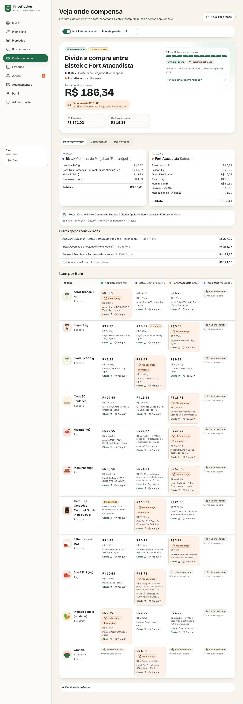
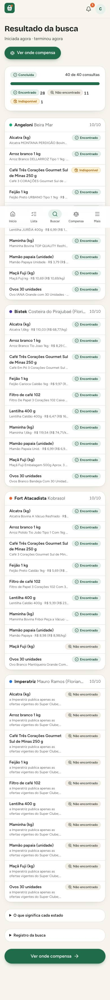
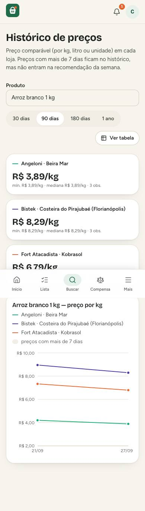

# PriceTracker

**Onde a compra da semana compensa** — compara a sua cesta entre Angeloni, Bistek, Fort Atacadista e
Imperatriz, somando o custo de ida e volta, com cobertura, frescor dos preços e confiança explícitos.
Instalação doméstica, multiusuário, em português.



## O que faz

- **Lista com fotos**: catálogo inicial ilustrado e produtos próprios (com foto enviada), quantidade
  da lista separada do tamanho da embalagem.
- **Buscas em segundo plano** nos quatro mercados, respeitando `robots.txt` e o ritmo de cada site,
  com status honestos por item: encontrado, não encontrado, indisponível, sem preço, bloqueado,
  tempo esgotado, falha na fonte, precisa de IA.
- **Três visões da comparação**: cesta comum, cobertura por mercado e plano econômico (uma loja ou
  divisão entre até três, com rota), sempre separando produtos, deslocamento e total.
- **Deslocamento conferível**: `distância ÷ km/l × R$/l + pedágios`, com a fórmula na tela.
- **Histórico** acessível (gráfico + tabela), preços antigos marcados e fora da recomendação,
  alertas de preço com avisos no app, agendamentos e painel de saúde das fontes.
- **Seguro por padrão**: contas locais (Argon2id), sem senha padrão, códigos de recuperação, CSRF,
  segredos só em arquivos, dados de cada usuário isolados.

| Celular (390 px) | | |
| --- | --- | --- |
|  |  |  |

## Começar (Docker, local)

Pré-requisitos: Docker com Compose v2.

```bash
./scripts/init-secrets.sh                  # segredos em ./secrets (fora do Git)
docker compose up -d --build               # sobe db, migrations, api, worker, scheduler e web
docker compose exec api pricetracker setup-code   # código de uso único para criar o administrador
```

Abra **http://localhost:8090**, informe o código e crie a conta de administrador. Guarde os códigos
de recuperação exibidos. Para ativar o fallback de IA (opcional), coloque a chave em
`secrets/groq_api_key` (ou importe de um `.env`: `./scripts/init-secrets.sh --import-groq .env`) e
reinicie: `docker compose up -d`.

Backup e restauração: `make backup` e `make restore-drill BACKUP=backups/pricetracker-<data>`.
Tudo sobre operação local em [`docs/operations.md`](docs/operations.md).

## Desenvolvimento

```bash
make bootstrap    # dependências (uv + npm)
make dev-db       # PostgreSQL descartável em 127.0.0.1:55433
make api          # API em :8000 (em outro terminal: make worker)
make web          # http://localhost:5173
make check        # lint + tipos + testes + varredura de segredos
make e2e          # cenários Playwright contra backend determinístico
```

Stack: Python 3.13, FastAPI, SQLAlchemy 2, Alembic, PostgreSQL 17, httpx; React 19, TypeScript,
Vite, Tailwind CSS 4, TanStack Query, Recharts; Playwright e Vitest; Docker Compose com Caddy.

## Documentação

| Documento | Conteúdo |
| --- | --- |
| [`docs/architecture.md`](docs/architecture.md) | Arquitetura, fluxo de uma busca, comparação, segurança |
| [`docs/decisions.md`](docs/decisions.md) | Decisões e trade-offs (ADRs) |
| [`docs/sources/readiness-matrix.md`](docs/sources/readiness-matrix.md) | Prontidão de cada mercado, com evidência |
| [`docs/operations.md`](docs/operations.md) | Instalação, primeiro acesso, backup, recursos, problemas conhecidos |
| [`docs/migrations.md`](docs/migrations.md) | Schema, verificação e como evoluir |
| [`docs/testing.md`](docs/testing.md) | Testes, cenários E2E e resultados |
| [`docs/backlog.md`](docs/backlog.md) | Riscos restantes e backlog priorizado |

## Estado

v1 funcional localmente. Angeloni, Bistek e Fort estão prontos; o **Imperatriz** só publica as
ofertas do Super Clube (cobertura parcial) e aguarda uma decisão — ver a matriz de prontidão.
Implantação em servidor está fora do escopo desta versão. O protótipo anterior está arquivado em
[`legacy/`](legacy/README.md).
