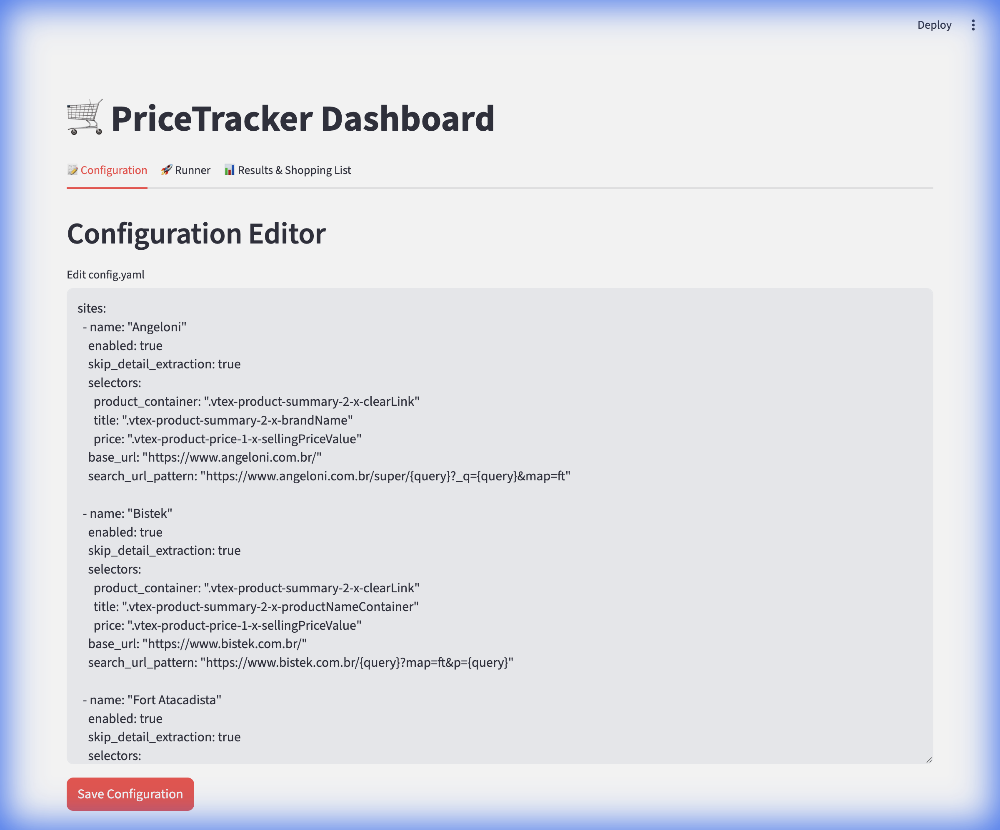
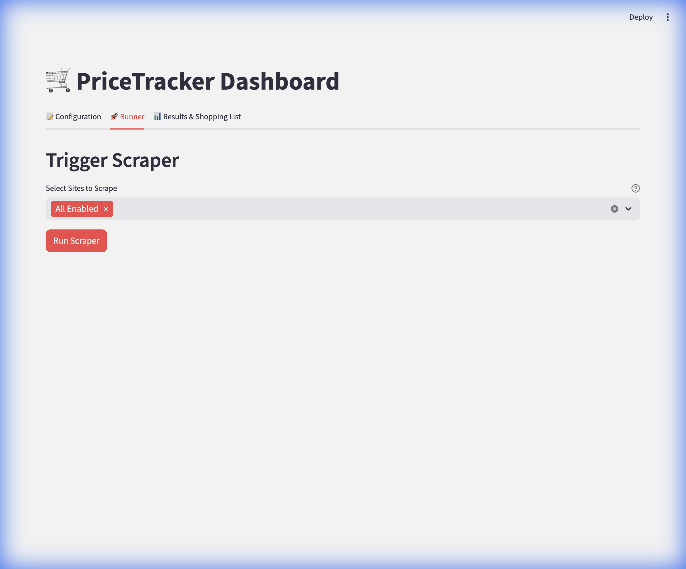
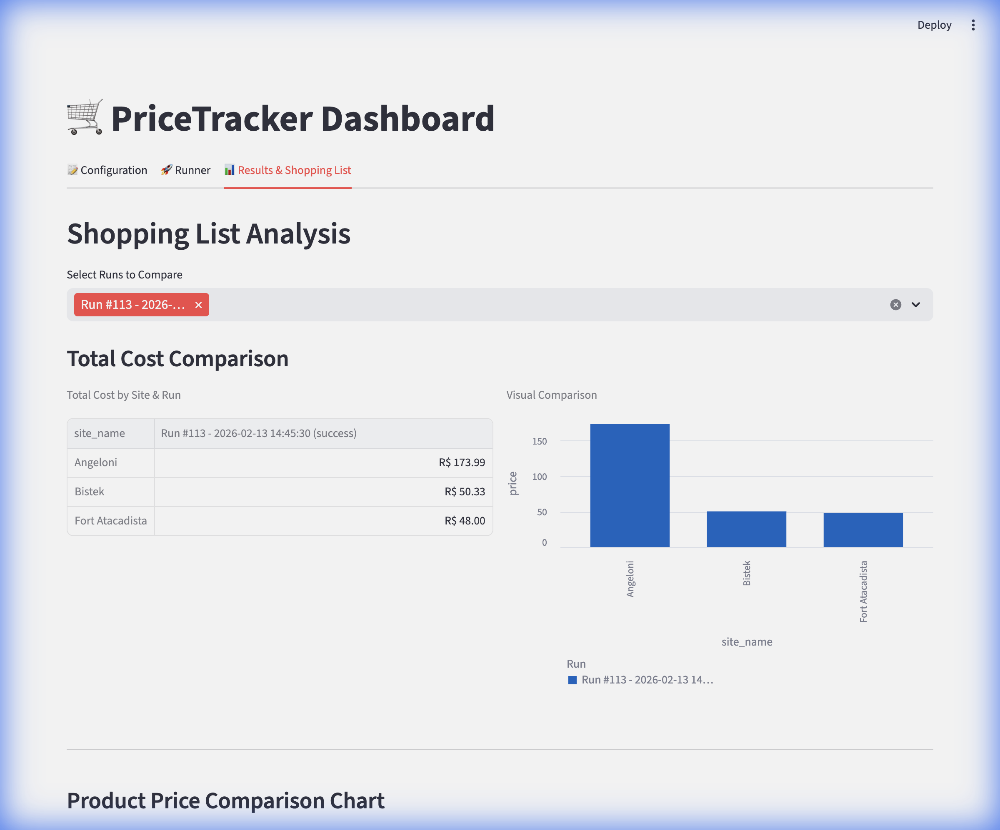
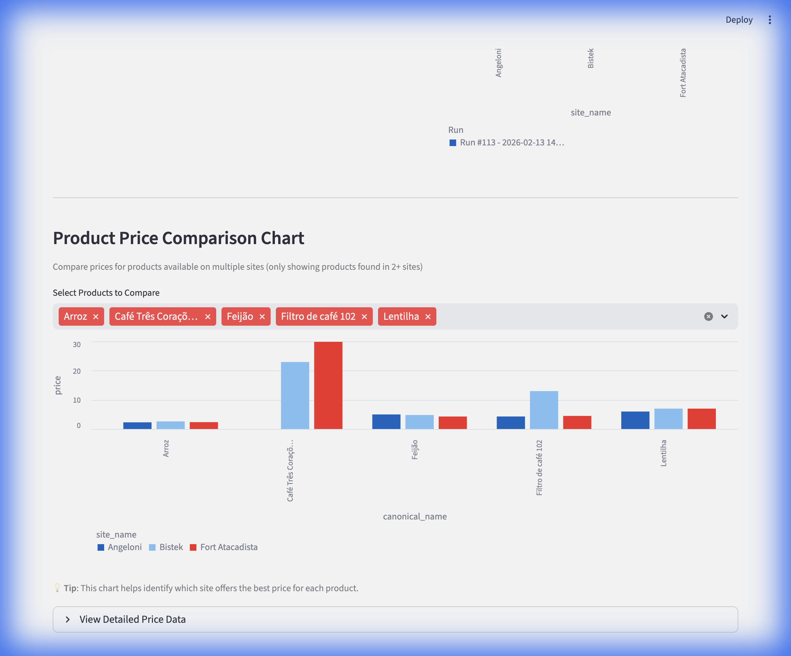
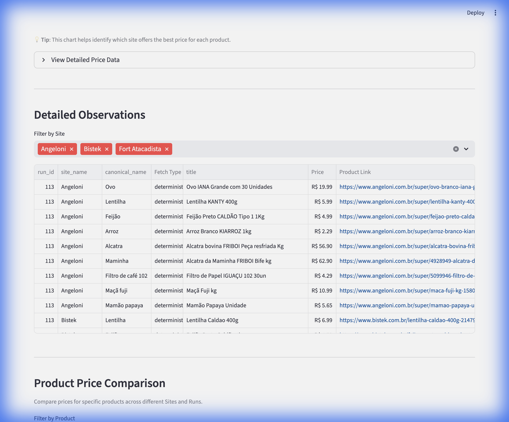

# 🛒 PriceTracker

> **Smart price tracking across supermarket websites using AI-powered web scraping**

PriceTracker is an intelligent price monitoring system that automatically tracks product prices across multiple supermarket websites. It combines browser automation with LLM-powered extraction to reliably find and compare prices, even when website structures change.

[](https://www.python.org/downloads/)
[](https://opensource.org/licenses/MIT)
[](https://streamlit.io)

---

## ✨ Features

### 🤖 **Hybrid Extraction Strategy**
- **Deterministic CSS Selectors**: Fast, reliable extraction when site structure is known
- **LLM Fallback**: AI-powered extraction adapts to website changes automatically
- **Smart Constraints**: Filter products by size, brand, and custom regex patterns

### 📊 **Interactive Dashboard**
- **Real-time Configuration**: Edit site configs and product lists on the fly
- **One-Click Scraping**: Run scrapers for all sites or specific targets
- **Visual Comparisons**: Compare prices across sites with interactive charts
- **Product-Level Analysis**: See which site offers the best price for each item
- **Historical Tracking**: SQLite database stores all price observations

### 🎯 **Intelligent Product Matching**
- **Constraint-Based Filtering**: Ensure you're comparing the same product sizes
- **Regex Support**: Flexible pattern matching for product attributes
- **Exclude Patterns**: Filter out unwanted product variations
- **Multi-Site Comparison**: Only compare products available on multiple sites

### 🚀 **Production Ready**
- **Database Migrations**: Alembic for schema version control
- **Async Support**: Playwright for efficient browser automation
- **Error Handling**: Robust fallback mechanisms
- **Extensible**: Easy to add new sites and products

---

## 📸 Screenshots

### Dashboard Overview

<details>
<summary><b>Configuration Editor</b></summary>



Edit your `config.yaml` directly in the browser with YAML validation.

</details>

<details>
<summary><b>Scraper Runner</b></summary>



Run scrapers for all enabled sites or select specific targets.

</details>

<details>
<summary><b>Total Cost Comparison</b></summary>



Compare total shopping basket costs across different supermarkets.

</details>

<details>
<summary><b>Product Price Comparison Chart</b></summary>



Visual comparison of individual product prices across sites (only shows products available on multiple sites for fair comparison).

</details>

<details>
<summary><b>Detailed Observations</b></summary>



Drill down into individual product observations with direct links to products.

</details>

---

## 🚀 Quick Start

### Prerequisites

- **Python 3.13+**
- **[uv](https://github.com/astral-sh/uv)** (recommended) or pip
- **LLM API Key** (Groq, OpenAI, or compatible provider)

### Installation

1. **Clone the repository**
   ```bash
   git clone https://github.com/yourusername/PriceTracker.git
   cd PriceTracker
   ```

2. **Install dependencies**
   ```bash
   uv sync
   uv run playwright install
   ```

3. **Set up environment variables**
   
   Create a `.env` file in the project root:
   ```bash
   GROQ_API_KEY="gsk_your_api_key_here"
   ```

4. **Configure sites and products**
   
   Edit `config.yaml` to add your target supermarkets and products (see [Configuration](#-configuration) below).

5. **Run the dashboard**
   ```bash
   uv run streamlit run dashboard.py
   ```

   The dashboard will open at `http://localhost:8502`

---

## ⚙️ Configuration

### Adding a New Site

Edit `config.yaml` and add a site entry:

```yaml
sites:
  - name: "YourSupermarket"
    enabled: true
    skip_detail_extraction: true  # Use search results page only
    base_url: "https://www.example.com"
    search_url_pattern: "https://www.example.com/search?q={query}"
    selectors:
      product_container: ".product-card"  # CSS selector for product containers
      title: ".product-title"              # CSS selector for product title
      price: ".product-price"              # CSS selector for product price
```

**Note**: If you don't provide `selectors`, the system will fall back to LLM-based extraction (slower but more flexible).

### Adding Products

Define products you want to track:

```yaml
products:
  - canonical_name: "Milk 2L"
    constraints:
      size: "2L"  # Exact match
      
  - canonical_name: "Rice"
    constraints:
      size: "regex:(?<!\\d,)(?:1\\s*kg|1,0+\\s*kg|kg)\\b"  # Regex pattern
      exclude: "regex:(organic|brown)"  # Exclude unwanted variants
```

### LLM Configuration

Configure your LLM provider in `config.yaml`:

```yaml
agent:
  provider: "groq"
  model: "llama-3.3-70b-versatile"
  api_key_env: "GROQ_API_KEY"
  base_url: "https://api.groq.com/openai/v1"
```

Supported providers: Groq, OpenAI, or any OpenAI-compatible API.

---

## 💻 Usage

### Command Line Interface

**Run all enabled sites:**
```bash
uv run python -m pricetracker.cli run
```

**Run specific site:**
```bash
uv run python -m pricetracker.cli run --site "Angeloni"
```

**Run specific product:**
```bash
uv run python -m pricetracker.cli run --product "Milk 2L"
```

**Combine filters:**
```bash
uv run python -m pricetracker.cli run --site "Angeloni" --product "Rice"
```

### Dashboard Interface

1. **Configuration Tab**: Edit `config.yaml` with live YAML validation
2. **Runner Tab**: Select sites and trigger scraping jobs
3. **Results Tab**: 
   - View total cost comparisons across sites
   - Compare individual product prices with interactive charts
   - Filter and explore detailed observations
   - Export data for further analysis

---

## 🗄️ Database

PriceTracker uses SQLite by default (`pricetracker.db`). The schema includes:

- **`runs`**: Scraping job metadata (start time, status, duration)
- **`observations`**: Individual product price observations with timestamps
- **`alembic_version`**: Schema version for migrations

### Database Migrations

Create a new migration:
```bash
uv run alembic revision --autogenerate -m "description"
```

Apply migrations:
```bash
uv run alembic upgrade head
```

---

## 🏗️ Architecture

```
PriceTracker/
├── pricetracker/
│   ├── agent/          # LLM-powered extraction logic
│   ├── browser/        # Playwright automation
│   ├── config/         # Configuration management
│   ├── database/       # SQLAlchemy models and migrations
│   ├── extractor/      # Hybrid extraction (CSS + LLM)
│   └── cli.py          # Command-line interface
├── alembic/            # Database migrations
├── assets/             # README screenshots
├── dashboard.py        # Streamlit dashboard
├── config.yaml         # Site and product configuration
└── pyproject.toml      # Project dependencies
```

### Key Components

- **`extractor/`**: Implements hybrid extraction strategy (deterministic CSS → LLM fallback)
- **`agent/`**: LLM prompts and response parsing
- **`browser/`**: Playwright-based web automation
- **`database/`**: SQLAlchemy models for runs and observations
- **`dashboard.py`**: Streamlit UI for configuration, execution, and analysis

---

## 🤝 Contributing

Contributions are welcome! Here's how you can help:

### Reporting Issues

- **Bug Reports**: Include steps to reproduce, expected vs actual behavior, and screenshots if applicable
- **Feature Requests**: Describe the use case and proposed solution
- **Site Support**: Request support for new supermarket websites

### Development Setup

1. **Fork the repository**
2. **Create a feature branch**
   ```bash
   git checkout -b feature/amazing-feature
   ```
3. **Install dev dependencies**
   ```bash
   uv sync --group dev
   ```
4. **Make your changes**
5. **Run tests**
   ```bash
   uv run pytest
   ```
6. **Commit your changes**
   ```bash
   git commit -m "Add amazing feature"
   ```
7. **Push to your fork**
   ```bash
   git push origin feature/amazing-feature
   ```
8. **Open a Pull Request**

### Code Style

- Follow PEP 8 guidelines
- Use type hints where applicable
- Add docstrings to public functions and classes
- Keep functions focused and testable

### Adding New Sites

When adding support for a new supermarket:

1. Test the CSS selectors thoroughly
2. Add example products to verify extraction
3. Document any site-specific quirks
4. Update `config.yaml` with the new site

---

## 📝 License

This project is licensed under the MIT License - see the [LICENSE](LICENSE) file for details.

---

## 🙏 Acknowledgments

- **[Playwright](https://playwright.dev/)** - Browser automation
- **[Streamlit](https://streamlit.io/)** - Dashboard framework
- **[Groq](https://groq.com/)** - Fast LLM inference
- **[SQLAlchemy](https://www.sqlalchemy.org/)** - Database ORM
- **[Alembic](https://alembic.sqlalchemy.org/)** - Database migrations

---

## 📧 Contact

Have questions or suggestions? Open an issue or reach out!

---

<div align="center">

**⭐ Star this repo if you find it useful!**

Made with ❤️ and 🤖

</div>
