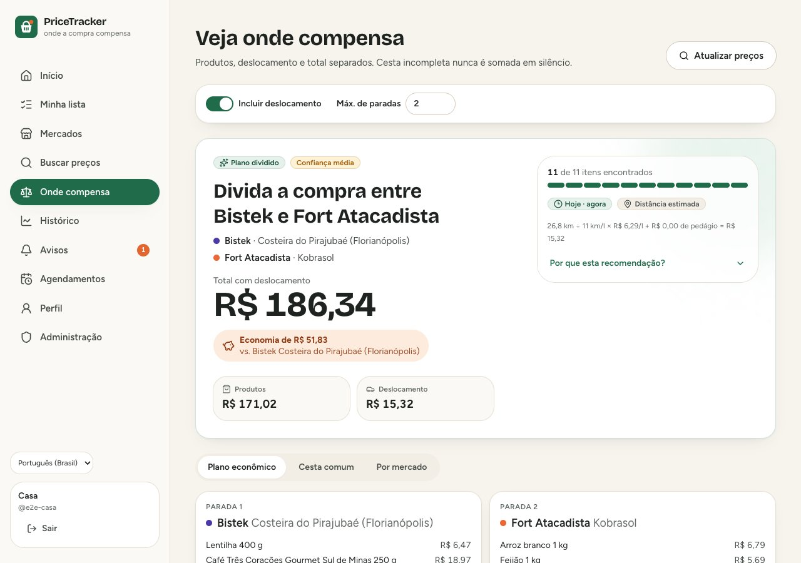
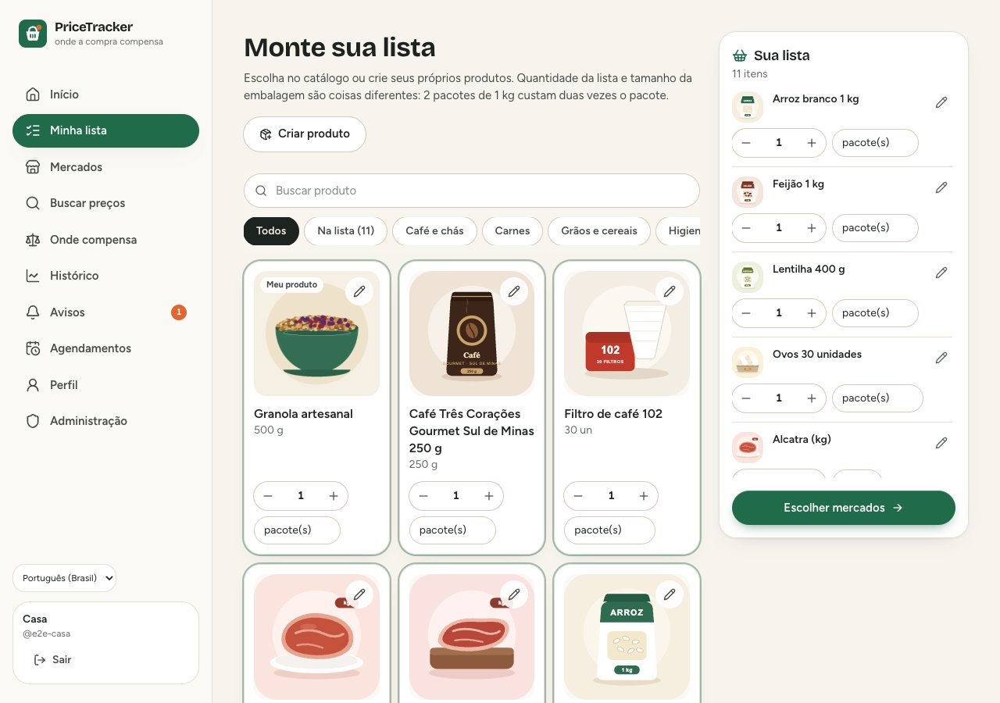
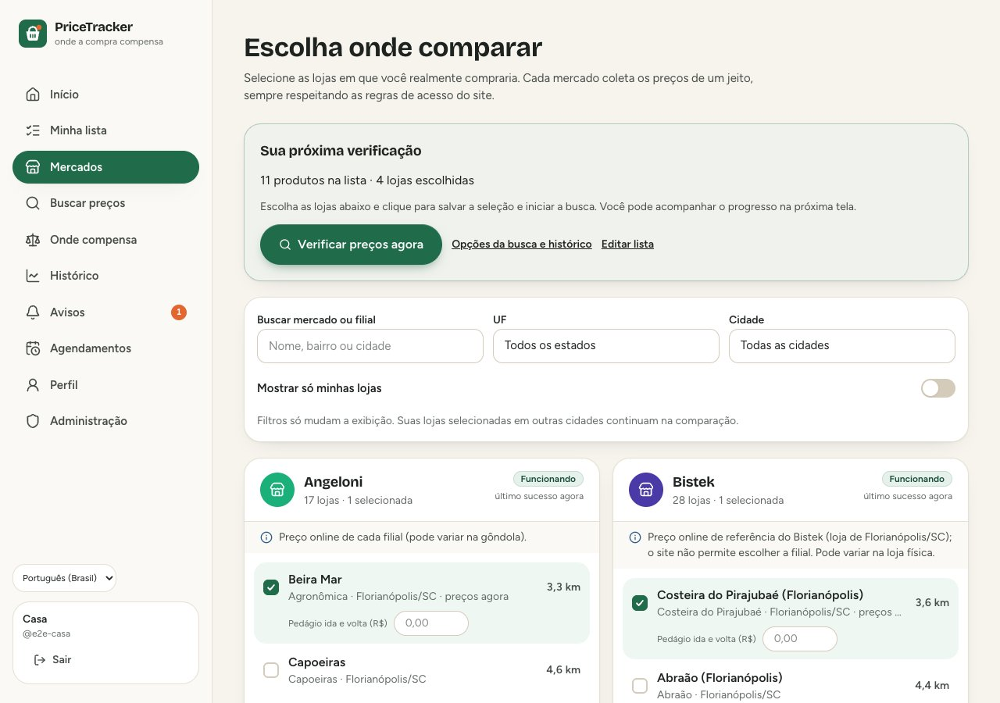
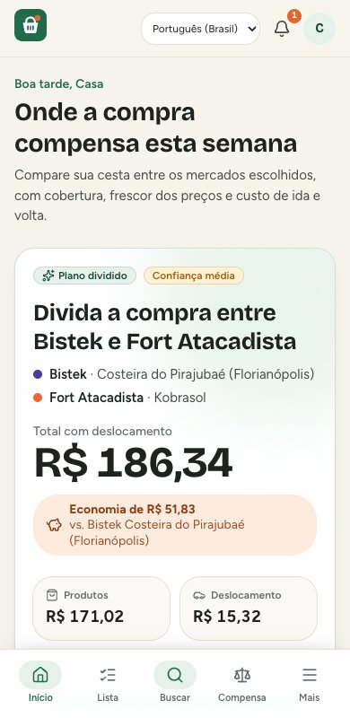
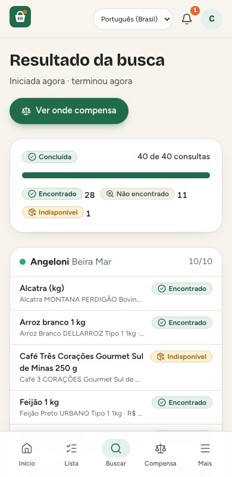
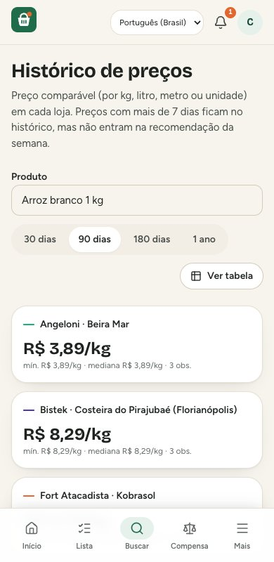

<div align="center">
  <picture>
    <source media="(prefers-color-scheme: dark)" srcset="docs/assets/wordmark-dark.svg">
    
  </picture>
  <h3>Faça seu orçamento de supermercado render mais.</h3>
  <p>Sua lista. Seus mercados. Preços que você pode conferir.</p>
  <p><a href="LICENSE">Licença MIT</a> · Português / English · Instalação com Docker</p>
  <p><a href="#começar-docker-local">Começar</a> · <a href="docs/user-guide.md">Como usar</a> · <a href="docs/markets.md">Adicionar mercado</a> · <a href="README.md">English</a></p>
</div>

Compare sua lista de supermercado, com o custo de ida e volta, a cobertura de cada loja e a data
dos preços. Instalação local, com contas independentes e interface em português e inglês.

**Começando agora?** Veja [como instalar e fazer a primeira compra](docs/getting-started.md).
Já tem uma conta em uma instalação? Veja o [guia de uso](docs/user-guide.md) ou abra **Mais → Como usar** no app.

**Funciona na minha região?** Atualmente há integrações para Angeloni, Bistek, Fort Atacadista e
Imperatriz. O administrador pode cadastrar filiais de outras cidades e estados dessas redes.
Para redes diferentes, o assistente **Adicionar novo mercado** testa preços públicos e o índice do
site. Sites compatíveis entram sem editar código; fontes com login, CEP ou formatos específicos
podem exigir uma integração própria.
O app usa BRL, endereços brasileiros; a interface tem opções pt-BR e inglês. Consulte [cobertura e cadastro de mercados](docs/markets.md).



## O que faz

- **Lista com fotos**: catálogo inicial ilustrado, edição pessoal de todos os produtos e produtos
  próprios (com foto enviada), quantidade da lista separada do tamanho da embalagem.
- **Mercados configuráveis**: ative/desative redes, cadastre e corrija filiais pela administração;
  assistente para novas redes compatíveis com preços públicos; cada pessoa filtra por UF/cidade
  e salva suas próprias lojas. **Verificar preços agora** salva e inicia a busca em um clique.
- **Buscas em segundo plano** nas redes integradas, respeitando `robots.txt` e o ritmo de cada site,
  com status honestos por item: encontrado, não encontrado, indisponível, sem preço, bloqueado,
  tempo esgotado, falha na fonte, precisa de IA.
- **Três visões da comparação**: cesta comum, cobertura por mercado e plano econômico (uma loja ou
  divisão entre até três, com rota), sempre separando produtos, deslocamento e total.
- **Deslocamento conferível**: `distância ÷ km/l × R$/l + pedágios`, com a fórmula na tela.
- **Histórico** acessível (gráfico + tabela), preços antigos marcados e fora da recomendação,
  alertas de preço com avisos no app, agendamentos e painel de saúde das fontes.
- **Seguro por padrão**: contas locais (Argon2id), sem senha padrão, códigos de recuperação, CSRF,
  segredos só em arquivos, dados de cada usuário isolados.

## Por dentro da interface

| Monte sua lista | Escolha os mercados |
| --- | --- |
|  |  |

| Início no celular | Busca | Histórico |
| --- | --- | --- |
|  |  |  |

As imagens mostram a interface atual com contas e fontes de demonstração; não representam
preços atuais dos mercados. Veja a [galeria completa, incluindo modo escuro](docs/screenshots/README.md).

## Começar (Docker, local)

Este guia descreve a reconstrução **v1**, na branch `feat/rebuild-v1`. O comando abaixo clona
essa versão. As instruções do protótipo anterior estão separadas em `legacy/`.

Pré-requisitos: Git, Docker em execução com Compose v2, Python 3 (para gerar os segredos) e um
terminal com shell POSIX. No Windows, execute os comandos em WSL2 com integração do Docker.
Não é necessário instalar Python 3.13, Node ou uma chave de IA para rodar a aplicação via Docker.

```bash
git clone --branch feat/rebuild-v1 https://github.com/moise-s/PriceTracker.git
cd PriceTracker                            # pasta do checkout da v1
./scripts/init-secrets.sh                  # segredos em ./secrets (fora do Git)
docker compose up -d --build               # sobe db, migrations, api, worker, scheduler e web
docker compose ps                         # aguarde os serviços persistentes ficarem healthy
docker compose exec api pricetracker setup-code   # código de uso único para criar o administrador
```

Abra **http://localhost:8090**, informe o código e crie a conta de administrador. Guarde os códigos
de recuperação exibidos. Configure as lojas em **Administração → Mercados** e selecione suas
filiais em **Mercados**. Monte a lista, busque preços e abra **Onde compensa**. Outras pessoas
podem receber contas em **Administração → Usuários**.

Para parar: `docker compose down` (os dados ficam nos volumes). Para voltar:
`docker compose up -d`. Não use `down -v` se quiser preservar os dados.

Para ativar o fallback de IA (opcional), coloque a chave em
`secrets/groq_api_key` (ou importe de um `.env`: `./scripts/init-secrets.sh --import-groq .env`) e
reinicie: `docker compose up -d`.

Backup e restauração: `make backup` e `make restore-drill BACKUP=backups/pricetracker-<data>`.
Tudo sobre operação local em [`docs/operations.md`](docs/operations.md).

## Desenvolvimento

```bash
make bootstrap    # dependências (uv + npm)
make dev-db       # PostgreSQL descartável em 127.0.0.1:55433
make dev-init     # cria schema e catálogo no banco de desenvolvimento
make dev-setup-code # código para o primeiro acesso em localhost:5173
make api          # API em :8000 (em outro terminal: make worker)
make web          # http://localhost:5173
make check        # lint + tipos + testes + varredura de segredos
make e2e          # cenários Playwright contra backend determinístico
```

Stack: Python 3.13, FastAPI, SQLAlchemy 2, Alembic, PostgreSQL 17, httpx; React 19, TypeScript,
Vite, Tailwind CSS 4, TanStack Query, Recharts; Playwright e Vitest; Docker Compose com Caddy.
Para desenvolvimento: Python 3.13+, uv, Node 22.12+ (ou uma versão posterior compatível), npm e
Docker. Veja [CONTRIBUTING.md](CONTRIBUTING.md), incluindo o roteiro para uma nova rede.

## Novos fluxos

No Início, escolha lojas e use **Atualizar preços**: revisar lista → confirmar mercados → buscar.
Após criar um produto, a interface volta à lista. O item padrão **Papel higiênico folha dupla**, na categoria Higiene, e seu modelo permitem
comparar qualquer embalagem pelo menor preço por metro, com custo de pacotes inteiros. A tabela de
histórico é ordenável em todas as colunas. Veja o [guia de uso](docs/user-guide.md).

O cadastro de uma rede nova reutiliza `public_jsonld`, sem LLM ou código gerado.
Veja [como a fonte é validada, salva e coletada](docs/markets.md).

## Documentação

| Documento | Conteúdo |
| --- | --- |
| [`docs/getting-started.md`](docs/getting-started.md) | Instalação e primeira comparação, sem conhecer a stack |
| [`docs/user-guide.md`](docs/user-guide.md) | Uso diário, contas, lista, comparação e solução de problemas |
| [`docs/markets.md`](docs/markets.md) | Cobertura regional, cadastro de filiais e limites de cada rede |
| [`CONTRIBUTING.md`](CONTRIBUTING.md) | Ambiente de desenvolvimento e contribuição de novos mercados |
| [`docs/architecture.md`](docs/architecture.md) | Arquitetura, fluxo de uma busca, comparação, segurança |
| [`docs/decisions.md`](docs/decisions.md) | Decisões e trade-offs (ADRs) |
| [`docs/sources/readiness-matrix.md`](docs/sources/readiness-matrix.md) | Prontidão de cada mercado, com evidência |
| [`docs/operations.md`](docs/operations.md) | Instalação, primeiro acesso, backup, recursos, problemas conhecidos |
| [`docs/migrations.md`](docs/migrations.md) | Schema, verificação e como evoluir |
| [`docs/testing.md`](docs/testing.md) | Testes, cenários E2E e resultados |
| [`docs/backlog.md`](docs/backlog.md) | Riscos restantes e backlog priorizado |

## Estado

v1 funcional localmente. A cobertura inicial concentra-se em SC, com filiais cadastradas também
em outros estados. Cadastrar uma filial não comprova que o site atende aquele CEP ou que os
preços são os da gôndola. O **Bistek** usa referência online de Florianópolis/SC; o **Imperatriz**
só publica ofertas do Super Clube (cobertura parcial). Ver a matriz de prontidão.
Implantação em servidor está fora do escopo desta versão. O protótipo anterior está arquivado em
[`legacy/`](legacy/README.md).


## Contribuição e licença

O projeto já usa a [licença MIT](LICENSE). Correções de usabilidade, acessibilidade, documentação
e novas integrações são bem-vindas; veja [CONTRIBUTING.md](CONTRIBUTING.md).
A cesta do logo, as ilustrações do catálogo e os logotipos do README são originais do projeto.
