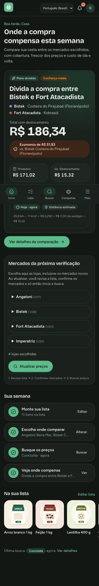
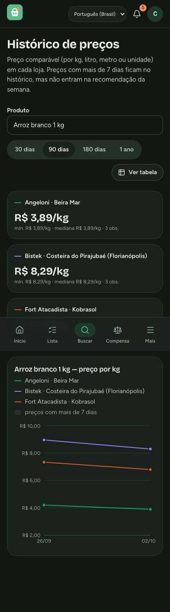

# Interface gallery

[README](../../README.md) · [Português](../../README.pt-BR.md)

These screenshots use the current Portuguese interface with demo accounts and deterministic price
fixtures. They contain no personal shopping data and do not show current supermarket prices.
README viewport previews are available in both English and Portuguese under `readme/`. Run `make e2e` to regenerate the gallery with the screenshot
matrix (`web/e2e/screens.spec.ts`).

| Screen | Desktop | Phone |
| --- | --- | --- |
| Home and market selection | [1280 px](1280/inicio.jpg) | [390 px](390/inicio.jpg) |
| Shopping list and catalog | [1280 px](1280/lista.jpg) | [390 px](390/lista.jpg) |
| Stores and regional filters | [1280 px](1280/mercados.jpg) | [390 px](390/mercados.jpg) |
| Search progress | [1280 px](1280/busca.jpg) | [390 px](390/busca.jpg) |
| Best value and travel costs | [1280 px](1280/onde-compensa.jpg) | [390 px](390/onde-compensa.jpg) |
| Price history | [1280 px](1280/historico.jpg) | [390 px](390/historico.jpg) |
| Product editor | [1280 px](1280/produto.jpg) | [390 px](390/produto.jpg) |
| Price notifications | [1280 px](1280/avisos.jpg) | [390 px](390/avisos.jpg) |
| Profile and travel settings | [1280 px](1280/perfil.jpg) | [390 px](390/perfil.jpg) |
| Administration | [1280 px](1280/admin.jpg) | [390 px](390/admin.jpg) |

## Dark mode

| Home | History |
| --- | --- |
|  |  |

The full matrix also includes 360 and 1440 px layouts. Checks cover horizontal overflow, content
clipped at the screen edge and serious/critical accessibility violations on the tested viewports.
